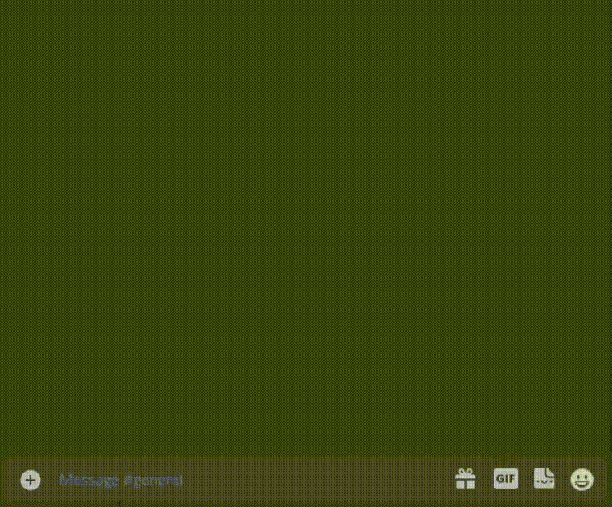
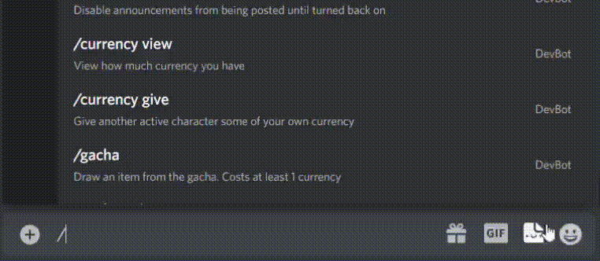
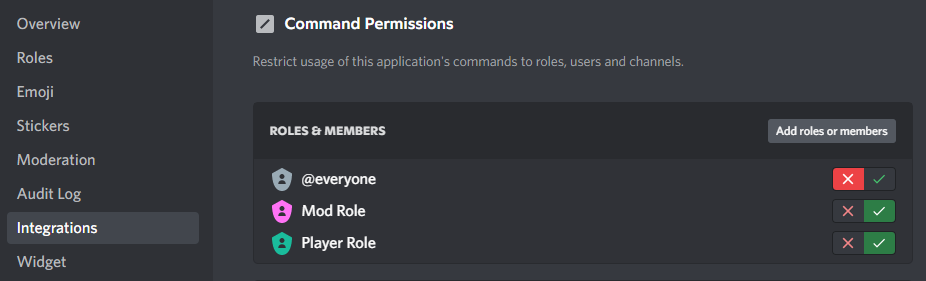
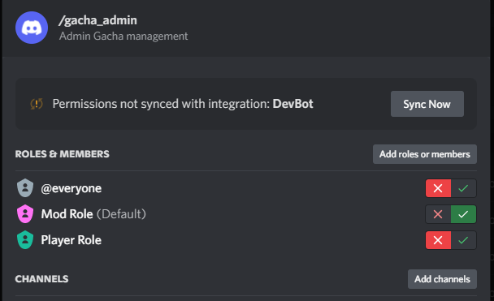
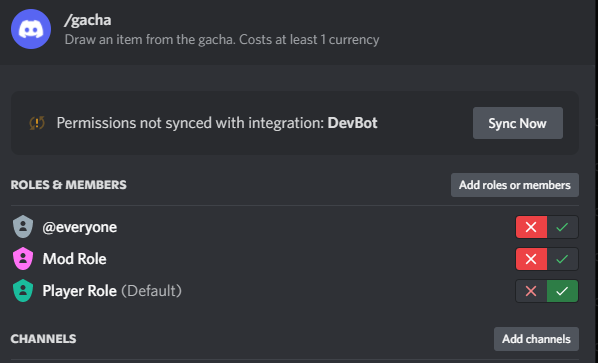

*Last updated: 26 May 2022*

# Introduction
Ultimate Assistant is a discord bot maintained by user @Firefly#7113. It aims to provide simple yet versatile utilities for discord-hosted rpgs ranging from asynchronous thread-style games to traditional sitdown tabletops. The bot includes a highly customizable profile system, automated/scheduled posting, flexible dice commands, inventories, and investigatable objects. 

Further information can be found on this repository's wiki including:
* Future updates and plans
* Hosting instructions
* Privacy Policy and Terms of Service

# Contributing
Ultimate Assistant now supports **localization**, and is in need of translators! No coding experience necessary! See the [contribution guidelines](./CONTRIBUTING.md) for full instructions!

Contributions to code, writing, and feature requests are always welcome.

# Examples

# Getting Started
1. With discord's permissions v2 update, admin permissions are now in the hands of server moderators. To grey out commands for non-players and non-admins, moderators should *heavily* consider using the Integration settings in their server settings like so:

2. Each player and character in your game will need to be registered with `/profile_admin new`. Players can have multiple registered characters each, but only one active character at a time.

3. It is recommended to give each player their own channel to receive messages generated by `/msg whisper` and `/msg anon`. Do this with `/profile_admin edit channel`.

# Support the Developer
Github contributions are always welcome! Or [commission](https://docs.google.com/document/d/1kM7qFBWqGsHktgrQHdCSf0HYJCfrTAa9MVsGPE8xF6A/edit?usp=sharing) them.

# References
https://docs.pycord.dev/en/master/index.html
